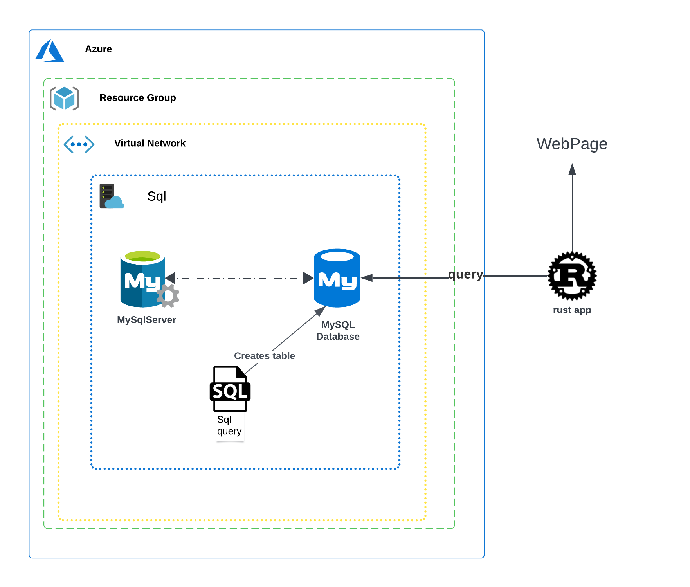
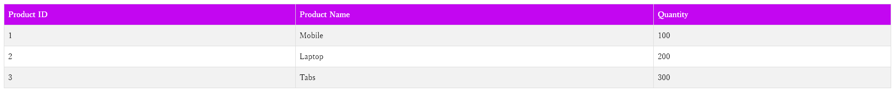

# SQL App Rust

A Rust application that interacts with an MsSql database and displays the data on a web page.

## Table of Contents

- [Introduction](#introduction)
- [Architecture](#architecture)
- [Prerequisites](#prerequisites)
- [Setup](#setup)
- [Running the Application](#running-the-application)
- [Technologies Used](#technologies-used)

## Introduction

This project demonstrates a simple Rust application that connects to an MsSql database, queries a table, and presents the information on a web page.

## Architecture

The application consists of a basic web server built with the `actix-web` crate. Database interactions are handled using the `tiberius` crate. The web page displays a list of products retrieved from the database.


> _Application Architecture_

## Prerequisites

Before you begin, ensure you have the following installed:
- Rust and Cargo
- An MsSql database instance

## Setup

1.  **Configure Database Connection:**
    *   Locate the `.env` file in the project root.
    *   Modify the database connection string to point to your MsSql instance.
2.  **Database Schema and Data:**
    *   The SQL script `script.sql` contains the necessary commands to create the `products` table and populate it with sample data.
    *   Execute this script in your MsSql database.

## Running the Application

1.  Open your terminal in the project's root directory.
2.  Run the application using the command:
    ```bash
    cargo run
    ```
3.  Open your web browser and navigate to `http://localhost:8080` to view the product list.


> _Web page displaying product list_

## Technologies Used

- Rust
- `actix-web` (for the web server)
- `tiberius` (for MsSql database connection)
- HTML (for rendering the web page)

