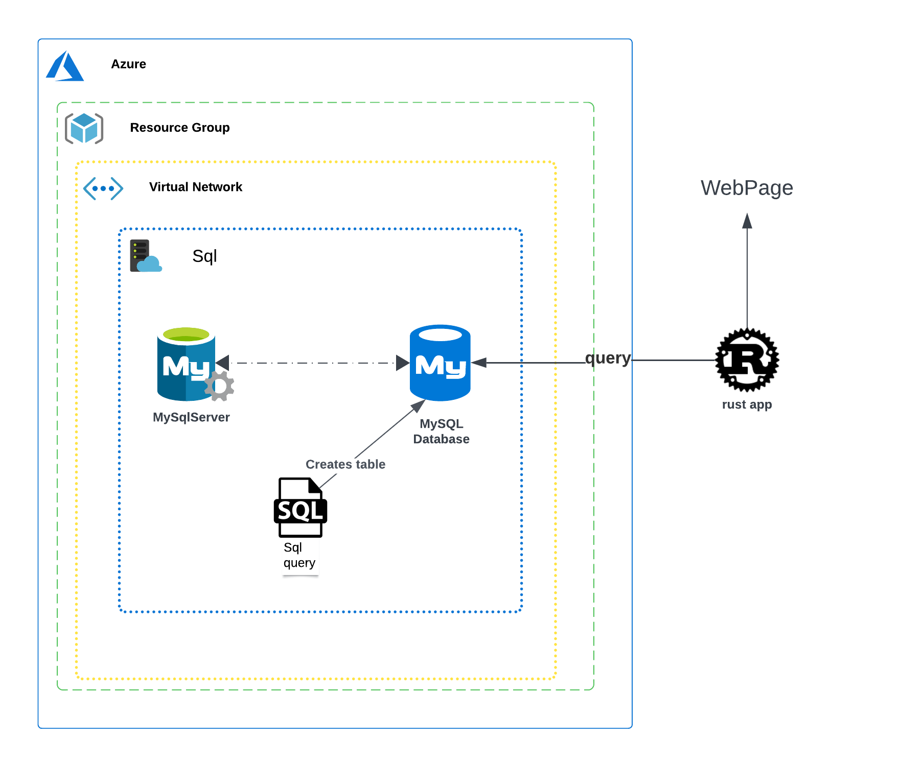
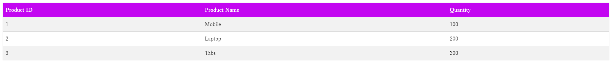

# Introduction

Here, a Rust application will interact with tables with an MsSql database, and query it to show a web page with the table.

>`Architecture`

The app is a simple web page that will show a list of products, the data will be queried from an MsSql database.

A simple web server will be created using the `actix-web` crate, and the database connection will be managed using the 'tiberius' crate.

## Before you begin

- First, change the database connection string in the `.env` file to your own. 
- The sql query can be found in the `script.sql` file. It will create a table and insert some data into it.
- Run the sql script in your database to create the table and insert the data.

## Running the application

- Run the application using `cargo run` and open the browser to `http://localhost:8080` to see the list of products.

- The app uses Html to render the page.